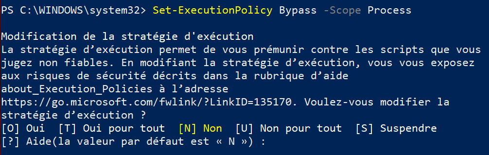
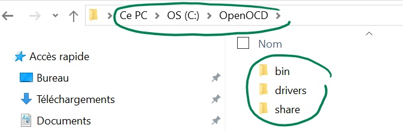
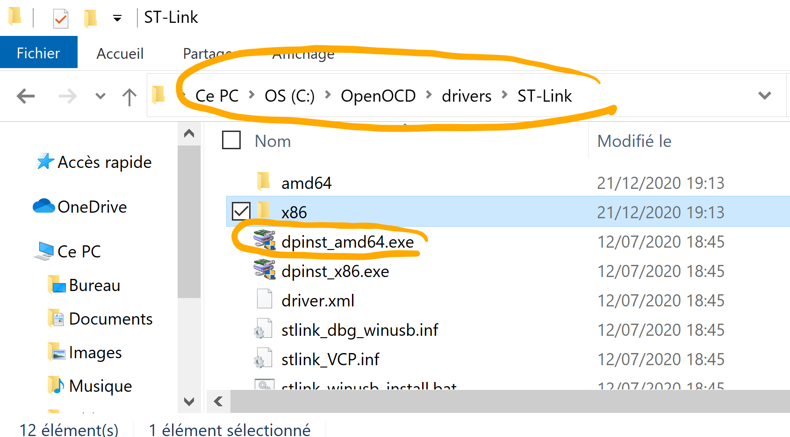
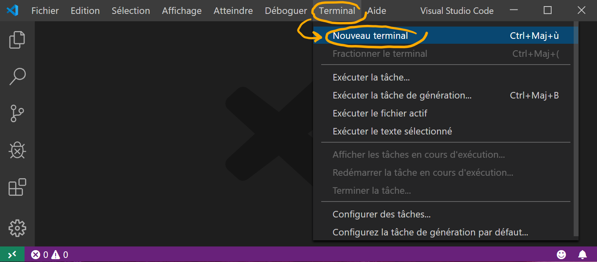
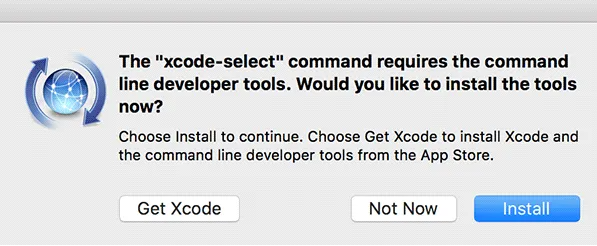
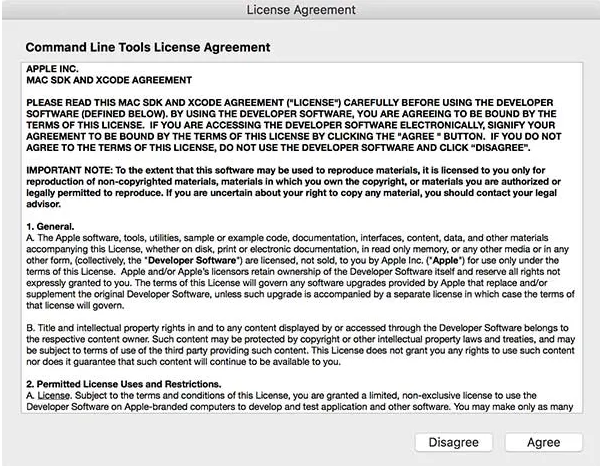
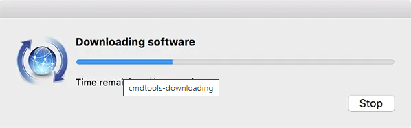
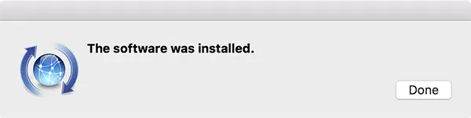

# Projet Robot

Dépôt pour les cours de Projet Robot à l'IUT de Cachan

## Règles à respecter

* Avant de démarrer un __projet Mbed__, vous devez avoir un __clone local__ de votre
repo.
* Chaque fichier `.h` (ou `.hpp`) créé doit être placé dans le dossier `include`.
* Chaque fichier `.c`(ou `.cpp`) créé doit être placé dans le dossier `src`.

## Par où commencer

### Comment cloner localement votre repo

* Récupérér le lien de votre repo :
    * Cliquer sur le bouton vert __Code__ et copier l'URL

* Cloner avec __Visual Studio Code__ :
    * Ouvrir Visual Studio Code
    * Appuyer sur `F1`, ensuite taper `clone`, choisissez `Git: Clone (récursif)`
    * Coller l'URL dans le champ demandé
    * Sauvegarder quelque part (à l'IUT, ce sera dans votre dossier qui est
    dans `C:\Travail`)
    * Cliquer sur `Open Repository`


### Branches, Commits, et Synchronisation
Pas d'explications, il faut pratiquer !

## À la maison 

<details>
<summary>Installation pour Windows (<i>cliquer pour développer</i>)</summary>

### Logiciels à installer
Vous devez installer les logiciels qui vous seront utiles pour travailler à
la maison. Pour cela, installer les _indispensables_ via l'application **_PowerShell_**. Pour ce 
faire :
* Taper _powershell_ sur le bouton _Démarrer_,
**faire un clic-droit** sur `Windows PowerShell` puis cliquer
`Exécuter en tant qu'administrateur`
* Taper la 1ère commande suivante dans la fenêtre de commande powershell puis
taper la touche _Entrée_
```powershell
Set-ExecutionPolicy Bypass -Scope Process
```
* Arrivé au stade illustré ci-dessous, taper `T` puis la touche _Entrée_
<br /><br /><br /><br />
* Taper la 2ème commande suivante dans la fenêtre de commande powershell puis
taper la touche _Entrée_
```powershell
Set-ExecutionPolicy Bypass -Scope Process -Force; [System.Net.ServicePointManager]::SecurityProtocol = [System.Net.ServicePointManager]::SecurityProtocol -bor 3072; iex ((New-Object System.Net.WebClient).DownloadString('https://chocolatey.org/install.ps1'))
```
* Taper la 3ème commande suivante dans la fenêtre de commande powershell puis
taper la touche _Entrée_
```powershell
choco install -y ninja cmake --installargs 'ADD_CMAKE_TO_PATH=System' mingw gcc-arm-embedded git vscode 7zip
```

Ensuite installer le _debugger on chip_
* [OpenOCD](https://sysprogs.com/getfile/1364/openocd-20201228.7z)
    * __Attention :__ en utilisant 7-Zip, décompresser le contenu dans `C:\OpenOCD`
    * __Attention :__ Vérifier bien que l'arborescence soit identique à la capture ci-dessous
    <br /><br />

Enfin installer le driver. Pour ce faire :
* Entrer dans le dossier `C:\OpenOCD`, puis dans le sous-dossier `drivers`, 
puis dans le sous-dossier `ST-Link`
* Lancer `dpinst_amd64.exe` comme dans la capture ci-dessous
    <br /><br />

### Phase finale d'installation 1 : Paramétrage du versionning dans _Visual Studio Code_
* Ouvrir _Visual Studio Code_
* Suivre les captures d'écran ci-dessous pour paramétrer vos
identifiants sur _Visual Studio Code_
<br /><br />
<br /><br />
<br /><br />

### Phase finale d'installation 2 : Installation des extensions dans _Visual Studio Code_
* Ouvrir _Visual Studio Code_
* Cloner votre repo
* Accepter toutes les requêtes d'installation d'extensions de
_Visual Studio Code_

</details>

<details>
<summary>Installation pour Mac (<i>cliquer pour développer</i>)</summary>

### Logiciels à installer

* Vous devez installer les logiciels qui vous seront utiles pour travailler à
la maison. Dans l'ordre, installer :
    * [XCode](https://apps.apple.com/fr/app/xcode/id497799835?mt=12)
    * [GNU ARM Toolchain](https://developer.arm.com/-/media/Files/downloads/gnu-rm/9-2020q2/gcc-arm-none-eabi-9-2020-q2-update-mac.pkg?revision=05bece2b-0d55-4247-a46c-25d6539c5a6e&la=en&hash=DBB15A859073008A60958F55569A4042F0B23158)


* Ouvrir un _terminal_
* Taper la 1ère commande suivante dans la fenêtre de commande puis
taper la touche _Entrée_
```bash
xcode-select --install
```
* Suivre les captures d'écran ci-dessous après avoir taper la
commande précédente
<br /><br />
<br /><br />
<br /><br />
<br /><br />

* Taper la 2ème commande suivante dans la fenêtre de commande puis
taper la touche _Entrée_
```bash
/bin/bash -c "$(curl -fsSL https://raw.githubusercontent.com/Homebrew/install/master/install.sh)"
```

* Taper la 3ème commande suivante dans la fenêtre de commande puis
taper la touche _Entrée_
```bash
brew install ninja cmake git openocd
```
* Taper la 4ème commande suivante dans la fenêtre de commande puis
taper la touche _Entrée_
```bash
brew install --cask visual-studio-code
```

### Phase finale d'installation 1 : Modification des variables d'environnement sous Mac
* Editer le chemin vers _Gnu ARM Embedded Toolchain_
en tapant la commande suivante:
```bash
nano ~/.zprofile
```
* Puis avec _nano_, ajouter la ligne suivante dans le fichier `.zprofile`
```bash
export PATH=/Applications/ARM/bin/:${PATH}
```

### Phase finale d'installation 2 : Paramétrage du versionning dans _Visual Studio Code_
* Ouvrir _Visual Studio Code_
* Suivre les captures d'écran ci-dessous pour paramétrer vos
identifiants sur _Visual Studio Code_
<br /><br />
<br /><br />
<br /><br />

### Phase finale d'installation 3 : Installation des extensions dans _Visual Studio Code_
* Ouvrir _Visual Studio Code_
* Cloner votre repo
* Accepter toutes les requêtes d'installation d'extensions de
_Visual Studio Code_

</details>

<details>
<summary>Installation pour Linux (<i>cliquer pour développer</i>)</summary>

### Logiciels à installer

* Vous devez installer les logiciels qui vous seront utiles pour travailler à
la maison. Dans l'ordre, installer :
    * [Visual Studio Code](https://code.visualstudio.com/download)
    * [GNU ARM Toolchain](https://developer.arm.com/-/media/Files/downloads/gnu-rm/9-2020q2/gcc-arm-none-eabi-9-2020-q2-update-x86_64-linux.tar.bz2?revision=05382cca-1721-44e1-ae19-1e7c3dc96118&la=en&hash=D7C9D18FCA2DD9F894FD9F3C3DC9228498FA281A)
        * Déplacer le dossier décompressé dans `/home/votre-login`
* Ouvrir un _Terminal_ et tapez les commandes suivantes
```bash
sudo apt update
sudo apt -y install openocd cmake ninja-build git
```

### Phase finale d'installation 1 : Modification des variables d'environnement sous Linux
* Editer le chemin vers _Gnu ARM Embedded Toolchain_
en tapant la commande suivante:
```bash
nano ~/.profile
```
* Puis avec _nano_, ajouter la ligne suivante dans le fichier `.profile`
```bash
export PATH=/home/votre-login/gcc-arm-none-eabi-9-2020-q2-update/bin:${PATH}
```

### Phase finale d'installation 2 : Paramétrage du versionning dans _Visual Studio Code_
* Ouvrir _Visual Studio Code_
* Suivre les captures d'écran ci-dessous pour paramétrer vos
identifiants sur _Visual Studio Code_
<br /><br />
<br /><br />
<br /><br />

### Phase finale d'installation 3 : Installation des extensions dans _Visual Studio Code_
* Ouvrir _Visual Studio Code_
* Cloner votre repo
* Accepter toutes les requêtes d'installation d'extensions de
_Visual Studio Code_

</details>
